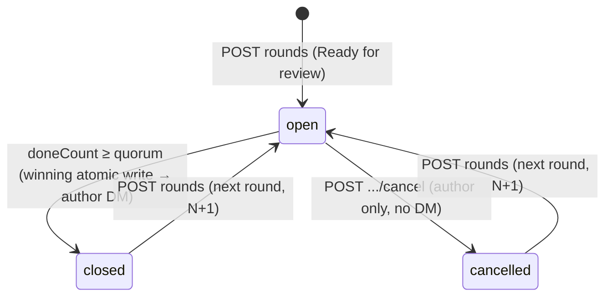

# 01 — Round Lifecycle (data + API)

Grill-me session, 2026-07-24. Feature 1 of PRSync: the round entity,
its Table Storage repository, and the rules that govern its lifecycle.
Fully testable via the API alone — no UI or bot dependency.

## Background

PRSync signals the moment a review _round_ is complete on a
spec-driven PR, so the author knows it is safe to regenerate the
implementation. This feature builds the backend that owns rounds:
opening, per-reviewer done-toggles, quorum-based closing, and
cancelling. It runs as Azure Functions over Azure Table Storage, with
the ADO extension panel (Feature 2) and Teams bot (Feature 3) layered
on later.

Prior context: the initial project grill-me established the
round/phase/reviewer vocabulary (see `docs/ubiquitous-language.md`).
This session refined that model — most significantly, replacing the
unanimity close rule with a **quorum**, after learning the real team
is 4 devs where only 2 of 3 reviewers need to finish.

## Problem

Define the round entity's storage shape and the exact rules for its
lifecycle transitions, with security as a first-class constraint
(injection, impersonation, PII). Specifically: how per-reviewer done
state is stored and mutated concurrently; when a round closes; how the
API authorizes a done-toggle to the right person; how round-lifecycle
triggers notifications without depending on the bot; and the concrete
HTTP surface.

## Questions and Answers

**Q1 — One row per round, or a header row plus one row per reviewer?**
✅ Single entity per round. Contention is negligible for
handful-of-reviewers teams; ETag optimistic concurrency handles rare
collisions; close-detection stays atomic (whole round is one entity);
panel reads are one GET. Per-reviewer ownership becomes a service-layer
identity rule, not physical row ownership.

**Q2 — Round-open contract: what does the API refuse to trust?**
Client sends what the API can't know (`prId`, `phase`, optional
`label`, `reviewers[]` snapshot, PR metadata). Server owns
`roundNumber`, `status`, timestamps, and generated label. Opening is
rejected `409` if a round is already open — enforcing "one open round"
server-side, not by trusting the client's view.

**Q3 — Reviewer identity fields, and the authoritative key?**
Snapshot `adoId` (immutable ADO GUID — the _sole_ authorization key),
`email` (inert data, for Teams resolution), `displayName` (cosmetic,
escaped). Never authorize against email/displayName. Also capture
`isRequired`.

**Q4 — Who counts toward close?** Containers (`isContainer`) and the
author are excluded at snapshot time _and re-validated server-side_
(defense in depth). Optional individuals are tracked + notified but do
not gate.

**Q5 / Q-followup — Close model.** Team has _no_ required reviewers and
only 2 of 3 need to finish → close is **quorum-based, not unanimity**.
Close when `doneCount ≥ quorum`. Quorum is a configurable constant,
default 2. Required-clause kept in the predicate but inert today.
Round-open blocked `422` when tracked individuals < quorum.

**Q6 — Done-toggle authorization.** Toggle target is _always_ the
authenticated caller — there is no reviewer-id field, so impersonation
is inexpressible. Identity verified against ADO via the SDK bearer
token, matched to a snapshot `adoId`. `done` is desired absolute state
(idempotent). Dedicated Entra app registration deferred as future
hardening.

**Q7 — Concurrency & exactly-once close.** ETag `If-Match` on every
mutation; bounded retry (3) on `412`; `503` on exhaustion. The
open→closed transition + author notification are bound to the single
winning atomic conditional write. Retry losers see `closed` and return
`409` without re-notifying.

**Q8 — Auto-close on reviewer removal?** ❌ Dropped — conflicted with
both the quorum model and the frozen-snapshot rule. A round leaves
`open` only via `closed` (quorum → author DM) or `cancelled`
(author-only, terminal, **no** notification). The API never watches
live ADO membership.

**Q9 — Notification seam.** A domain-language `NotificationPort`
(`roundOpened` / `roundClosed`) called post-commit, failures isolated.
v1 = no-op logging stub. Delivery reliability deferred to Feature 3
behind the port. Feature 1 owns _which transition fires_; Feature 3
owns _reliable delivery_.

**Q10 — API surface & PR key.** `PartitionKey =
{projectId}:{repositoryId}:{pullRequestId}` (raw PR number is not
globally unique). Latest-round-only reads (history deferred). Route
params shape-validated before any storage call.

**Q11 — Label/phase mutability after open.** Phase frozen after open
(fix via cancel + reopen; no endpoint). Label editable while open via
`PATCH …/{n}` — author-only, open-only, display-only (never alters a
sent DM).

**Q12 — Entity schema.** `quorum` snapshotted per round (config changes
don't move goalposts mid-round). ISO-string dates. Derived state never
persisted. Reserved nullable `teamsIdOverride` per reviewer.
`schemaVersion: 1`.

**Q13 — Security posture.** zod strict validation (reject-unknown) at
the boundary; injection eliminated structurally via point-reads-only
(no user input ever enters an OData filter); uniform ADO-token authz
including on `GET`; PII-safe logging (never log tokens/emails).
Rate-limiting explicitly deferred.

## Design

### Storage entity — one entity per round

`PartitionKey = {projectId}:{repositoryId}:{pullRequestId}`,
`RowKey = ` zero-padded round number (`0001`).

| Property                                   | Type                   | Notes                                          |
| ------------------------------------------ | ---------------------- | ---------------------------------------------- |
| `PartitionKey`                             | string                 | composite PR key                               |
| `RowKey`                                   | string                 | zero-padded round number                       |
| `roundNumber`                              | int32                  | typed mirror of RowKey                         |
| `phase`                                    | string                 | `spec` \| `implementation` — frozen after open |
| `label`                                    | string                 | editable while open                            |
| `status`                                   | string                 | `open` \| `closed` \| `cancelled`              |
| `quorum`                                   | int32                  | snapshotted at open                            |
| `reviewers`                                | string (JSON)          | array of reviewer sub-objects                  |
| `prTitle`, `prUrl`                         | string                 | for notification cards                         |
| `authorAdoId`, `authorName`, `authorEmail` | string                 | author identity                                |
| `openedAt`                                 | string (ISO)           | ISO string, not Table `DateTime`               |
| `closedAt`                                 | string (ISO) \| absent | set on close                                   |
| `cancelledAt`                              | string (ISO) \| absent | set on cancel                                  |
| `schemaVersion`                            | int32                  | `1`                                            |

Reviewer sub-object (in `reviewers` JSON):

```ts
interface RoundReviewer {
  adoId: string; // immutable ADO GUID — the sole authz key
  email: string; // inert data; feeds Feature 3 Teams resolution
  displayName: string; // cosmetic, escaped on render
  isRequired: boolean; // gating hint (inert today — no required reviewers)
  done: boolean;
  doneAt?: string; // ISO
  teamsIdOverride?: string | null; // reserved, unused in v1
}
```

Derived and **never stored**: `doneCount`, "quorum met", the gating set
— all computed from `reviewers` + `quorum` at read time.

### Close predicate

```
closed  ⟺  doneCount ≥ quorum  AND  (all required reviewers done)
```

Required-clause is vacuously true today (no required reviewers), so in
practice `doneCount ≥ 2`. Gating set = required, non-container
reviewers excluding the author; if none required, all tracked
individuals gate. `quorum` is read from config at open time and
snapshotted into the round.

### Lifecycle



Only one round per PR may be `open` at a time. Next round number =
`lastRound + 1` (or 1 if none). Open rejected `409` if current round is
still `open`.

### API surface (five endpoints)

CORS locked to the ADO org origin; all require a valid ADO bearer token.

| Method & route                            | Purpose                           | Success            | Key errors                                                |
| ----------------------------------------- | --------------------------------- | ------------------ | --------------------------------------------------------- |
| `GET /api/prs/{prKey}/rounds/current`     | latest round (any status)         | `200` / `204` none | `400` malformed key                                       |
| `POST /api/prs/{prKey}/rounds`            | open next round                   | `201`              | `409` already open · `422` tracked < quorum               |
| `PATCH /api/prs/{prKey}/rounds/{n}/done`  | toggle own Done (target = caller) | `200`              | `403` not in snapshot · `409` not open · `401` unverified |
| `PATCH /api/prs/{prKey}/rounds/{n}`       | edit label (author)               | `200`              | `403` not author · `409` not open                         |
| `POST /api/prs/{prKey}/rounds/{n}/cancel` | cancel round (author)             | `200`              | `403` not author · `409` not open                         |

### Authorization

- **Done-toggle:** target is the authenticated caller only. Body =
  `{ done }`; no reviewer id exists to name someone else. Bearer token
  resolved against ADO → identity must match a snapshot `adoId`.
- **Cancel / label-PATCH:** author-only — resolved identity must equal
  `authorAdoId`.
- **GET current:** requires a valid ADO token (reviewer emails are PII;
  no anonymous reads). Per-PR fine-grained authz deferred.

### Notification seam

```ts
interface NotificationPort {
  roundOpened(event: RoundOpened): Promise<void>; // → each tracked reviewer
  roundClosed(event: RoundClosed): Promise<void>; // → author
}
```

Called post-commit; failures caught, logged, isolated — never fail or
roll back the round transition. v1 implementation = no-op logging stub.
Feature 3 supplies the Bot Framework adapter (and any queue/outbox for
delivery reliability) behind this same interface.

### Layer placement (`packages/api/src/`)

- `functions/` — five HTTP entry points; parse + validate (zod) + call a service.
- `services/` — `RoundService` (lifecycle rules, close predicate,
  NotificationPort trigger); `NotificationPort` interface + no-op stub.
- `storage/` — `RoundRepository` over `@azure/data-tables`; point
  reads/writes only, ETag concurrency.
- `lib/` — pure helpers: prKey build/parse, round-number derivation,
  label generation, gating-set + close-predicate computation, reviewer
  snapshot filtering. Every `lib/` function has a test.

### Security posture

- **Validation:** zod at the boundary, reject-unknown-fields; `prKey`
  matches `guid:guid:int`; `{n}` positive int; `phase` enum; `label` ≤
  200; `reviewers[]` ≤ 50, each field typed/bounded; max body size.
- **Injection:** eliminated structurally — all storage access is point
  reads/writes (`getEntity` by exact keys). No user input ever enters
  an OData filter string.
- **Inert storage:** `label`/`displayName`/`email` stored as validated
  data via `JSON.stringify`; rendered React-escaped; bound as text in
  cards.
- **PII/logs:** no `console.log`; context logger only; never log tokens
  or emails; correlate on `prKey` + `roundNumber` (+ `adoId`).
  Connection string from app settings / Key Vault, never code.

## Implementation Plan

Each phase is a thin working vertical slice, TDD (RED → build).

1. **`lib/` pure helpers.** prKey build/parse, round-number
   derivation, label generation, reviewer snapshot filtering
   (containers/author out), gating-set + close-predicate
   (`doneCount ≥ quorum`). Fully unit-tested, no I/O. _Thinnest
   end-to-end value: the domain rules exist and are proven._
2. **`storage/RoundRepository`.** Point read/write of the round entity
   over Table Storage, ETag concurrency, `reviewers` JSON
   (de)serialization. Tested against the Azurite emulator.
3. **`services/RoundService` — open + GET.** Open a round (server-owned
   number/status, `409`/`422` guards, quorum snapshot), read current.
   `NotificationPort` interface + no-op stub; assert `roundOpened`
   fires. zod validation wired in `functions/`.
4. **Done-toggle + close.** Authenticated-caller target, ADO identity
   resolution, idempotent absolute `done`, atomic close transition,
   exactly-once `roundClosed`, ETag retry loop.
5. **Cancel + label-PATCH.** Author-only transitions, `cancelled`
   state, open-only label edit.
6. **Cross-cutting security pass.** CORS lockdown, GET auth, PII-safe
   logging audit, body-size limits.

## Trade-offs

**Easier:**

- Atomic close-detection and exactly-once author notification fall out
  of the single-entity + winning-conditional-write design.
- Injection is _impossible by construction_ (point reads only), not
  merely escaped.
- Impersonation is _inexpressible_ (no reviewer-id field), not merely
  denied.
- Feature 1 ships and is fully tested with zero bot/UI code, behind the
  `NotificationPort` seam.

**Harder / deferred:**

- Concurrent done-toggles contend on one entity → ETag retry loop
  (acceptable at handful-of-reviewers scale; would need the row-per-
  reviewer split only at much larger scale).
- Delivery reliability (queue/outbox) is pushed to Feature 3 — Feature
  1 guarantees the _decision_, not the _delivery_.
- Dedicated Entra app registration (audience-scoped JWT, no per-toggle
  ADO round-trip) deferred; v1 pays one ADO identity resolution per
  mutating call.

**Ruled out of scope:**

- Auto-close on ADO reviewer removal — conflicts with the
  frozen-snapshot rule and is moot under quorum; replaced by
  author-driven Cancel round.
- Live ADO membership polling anywhere — snapshot is authoritative.
- Round history / list endpoints — latest-round-only in v1.
- Phase editing after open — fix via cancel + reopen.
- Request rate-limiting — acceptable gap for an internal, authenticated
  tool.
