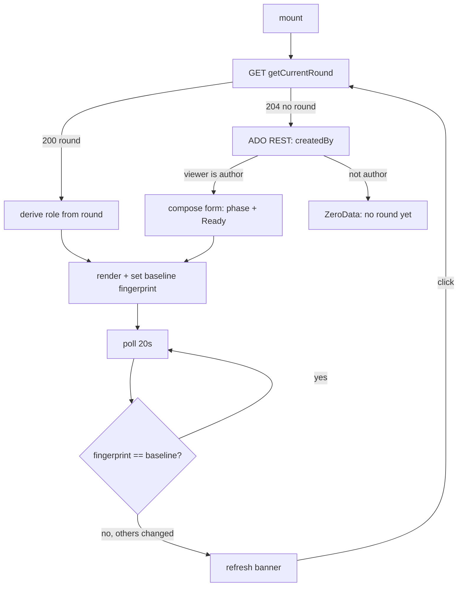
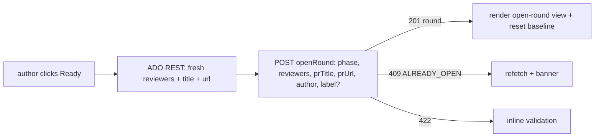

# 02 — Extension Panel

Grill-me session, 2026-07-25. Feature 2 of PRSync: the Azure DevOps
PR-page panel, wired to Feature 1's round-lifecycle API. Builds on
`docs/handoff/panel-layout-spec.md` (the component layout standing in
for a Claude Design prototype) and consumes the five HTTP endpoints
shipped by Feature 1.

## Background

Feature 1 delivered the round entity and its lifecycle API
(`getCurrentRound`, `openRound`, `toggleDone`, `editLabel`,
`cancelRound`) — fully testable with no UI. Feature 2 is the first
user-facing surface: a React + `azure-devops-ui` panel contributed as
an `ms.vss-web.tab` on `ms.vss-code-web.pr-detail-page`, running inside
an ADO-hosted iframe. It reads round state from the PRSync API and, at
exactly one moment ("Ready for review"), reads ADO's own PR REST API to
snapshot the live reviewer list.

Prior context: `docs/handoff/panel-layout-spec.md` (7 components, top to
bottom), `docs/ubiquitous-language.md` (round/phase/done/quorum/gating
set), and the Feature 1 `Round` type in
`packages/api/src/lib/types/types.ts`. The panel package
(`packages/extension`) is scaffolded but empty (`src/index.tsx` is a
stub).

## Problem

Define how the panel sources its data (PRSync API vs. ADO REST vs. the
extension SDK), how it selects the author/reviewer/bystander view
without trusting the client for authorization, how it maps the five
endpoints to UI controls, how it detects background drift without a
silent live-patch, and its internal architecture, testing seam, and
build/packaging path. A key gap to resolve: the layout spec omits any
Cancel-round control although the endpoint and ubiquitous language
require one.

## Questions and Answers

**Q1 — Where do reviewer rows come from: live ADO, or the round?**
✅ Purely from `round.reviewers` (PRSync API). The reviewer list is a
frozen open-time snapshot; rendering ADO's live list on an open round
would contradict the model. ADO's live list is read at one moment only
(Q5).

**Q2 — How does the panel know who the viewer is?**
`SDK.getUser().id` (the ADO identity GUID = `adoId`), used _only_ to
choose the view. Authorization stays server-side: every mutation is
authorized by the API against the `SDK.getAccessToken()` bearer token,
so a spoofed client identity changes nothing.

**Q3 — How is the PR key built?**
From the PR-tab contribution context (`projectId`, `repositoryId` as
GUIDs, `pullRequestId` as int), assembled with a client copy of
`buildPrKey` so the `{guid}:{guid}:{int}` format matches
`packages/api/src/lib/prKey` exactly.

**Q4 — Load sequence.**
On mount → `getCurrentRound`.

- `200` (round exists): derive the whole view from the round
  (author = `authorAdoId`; reviewer = match in `round.reviewers`;
  otherwise bystander). No ADO REST call.
- `204` (no round): one ADO REST read of `createdBy` to decide
  author (→ compose form) vs. bystander (→ ZeroData "No round yet").

**Q5 — When is ADO's live reviewer list read?**
Only at the "Ready for review" click — a fresh fetch of reviewers +
title + URL for the `openRound` snapshot. Never at load, never on a
poll.

**Q6 — Cancel round: the layout spec omits it. Add it?**
✅ Add it. Author-only, visible only while a round is `open`, rendered
as a secondary/danger `Button` with a "Cancel round?" confirmation
`Dialog` (a silent abandonment deserves a confirm). Without it the
author has no UI recovery for a mistaken open or an unreachable quorum,
and the `cancelRound` endpoint would be dead from the UI. The
panel-layout-spec is amended to include it. ❌ Leave out of v1 —
rejected: strands a shipped endpoint and a real recovery path.

**Q7 — Done toggle: optimistic or wait?**
✅ Optimistic — flip immediately, `PATCH`, then replace panel state with
the returned `Round` (authoritative; surfaces auto-close when quorum is
met, freezing the list). On error, revert + inline message.

**Q8 — Default round label & phase at compose time.**
Label `Round {n} — {Spec|Implementation} Review` where
`n = last.roundNumber + 1` (or `1`). Shown as the field value; if the
author leaves it untouched, **omit `label`** from `openRound` so the API
generates canonically (no UI/DB divergence); if edited, send it. Default
phase = previous round's phase if one exists, else `spec`.

**Q9 — Drift detection without an etag.**
The `Round` has no `updatedAt`/etag, so compute a **client fingerprint**
of `roundNumber` + `status` + `phase` + `label` + each reviewer's
`done`, compared against a **baseline**. Own mutations reset the
baseline (so they never self-trigger); a poll divergence means _someone
else_ changed state → show the refresh banner (`MessageCard`, info),
never a silent patch. Clicking the banner refetches, re-renders, resets
the baseline.

**Q10 — Polling cadence.**
`getCurrentRound` every 20s (within the spec's 15–30s), paused while a
mutation is in flight and while the tab is hidden (Page Visibility API).

**Q11 — Error mapping.**
A pure, tested `mapApiError(status, code)` → message + recovery:
`409 ROUND_ALREADY_OPEN`/`ROUND_NOT_OPEN` and `403
NOT_AUTHOR`/`NOT_A_REVIEWER` → state drifted: refetch + banner (the UI
should rarely allow these); `422` → inline validation (e.g. "needs a
required reviewer in ADO"); `503 CONCURRENCY_EXHAUSTED` → auto-retry
once then "try again"; `401` → "session expired, refresh".

**Q12 — Pre-validate openRound?**
Light client check: if the fresh snapshot has zero non-container
individuals besides the author, disable Ready-for-review with a hint.
The `422` mapping is the backstop — gating logic remains server-owned.

**Q13 — Internal architecture depth.**
✅ Mirror the API's discipline: folder-per-module + one barrel per
layer, co-located tests, same import conventions as `packages/api`.
❌ Lighter UI-conventional split — rejected for monorepo consistency
(portfolio + team use).

**Q14 — Testing seam.**
Dependency-inject the `sdk`/`api`/`ado` clients into the `App` container
(fakes in tests) rather than `vi.mock`-ing the SDK; components via
`@testing-library/react`; pure `lib` unit-tested. Add a Vitest `jsdom`
config + setup (none exists yet).

**Q15 — How to call ADO's REST API.**
✅ Add `azure-devops-extension-api` — typed `GitClient`
(`getPullRequestById`) returning `IdentityRefWithVote` reviewers that
map cleanly to `IncomingReviewer`. ❌ Hand-rolled `fetch` — rejected: we
would own ADO's response shape and URL construction.

## Design

### Roles

Three viewer roles, derived locally (presentation only; never trusted
for authorization):

| Role          | Detected by                                                           | Can do                                                                    |
| ------------- | --------------------------------------------------------------------- | ------------------------------------------------------------------------- |
| **Author**    | `viewerAdoId === round.authorAdoId` (or PR `createdBy` when no round) | edit label (open), toggle phase (compose), Ready for review, Cancel round |
| **Reviewer**  | `viewerAdoId` matches a `round.reviewers[i].adoId`                    | toggle own Done (only while `open`)                                       |
| **Bystander** | neither                                                               | read-only                                                                 |

### Endpoints → controls

| Control (panel-layout-spec)   | Endpoint                     | Gating                       |
| ----------------------------- | ---------------------------- | ---------------------------- |
| Round label (edit)            | `PATCH editLabel`            | author, `status === "open"`  |
| Phase toggle                  | (compose-only → `openRound`) | author, no open round        |
| Reviewer Done checkbox        | `PATCH toggleDone`           | own row, `status === "open"` |
| Ready for review              | `POST openRound`             | author, no open round        |
| **Cancel round** _(added Q6)_ | `POST cancelRound`           | author, `status === "open"`  |
| Refresh banner                | (re-`GET getCurrentRound`)   | shown on fingerprint drift   |

### Package layout (`packages/extension/src/`)

Folder-per-module + one barrel per layer, mirroring `packages/api`:

```
src/
├── index.tsx                 # SDK.init, mount <App>, notifyLoadSucceeded
├── App/                      # container: load, poll, mutations, wiring
│   ├── App.tsx
│   └── App.test.tsx
├── sdk/                      # ONLY module importing azure-devops-extension-sdk
│   ├── index.ts              # barrel
│   └── AdoSdk/               # getUser, getAccessToken, prKeyParts, resize, theme
├── api/                      # PRSync API client (getCurrentRound, openRound, ...)
│   ├── index.ts
│   └── PrsyncClient/
├── ado/                      # ADO REST via azure-devops-extension-api GitClient
│   ├── index.ts
│   └── AdoClient/            # getPullRequestReviewers/createdBy/title/url
├── lib/                      # pure, every module tested
│   ├── index.ts
│   ├── buildPrKey/           # client copy matching api/src/lib/prKey format
│   ├── roundFingerprint/     # drift signal
│   ├── deriveRole/           # author | reviewer | bystander
│   ├── deriveDefaultLabel/   # "Round {n} — {Phase} Review"
│   └── mapApiError/          # {status,code} -> message + recovery
└── components/               # pure, prop-driven azure-devops-ui components
    ├── index.ts
    ├── PanelHeader/
    ├── RoundLabel/
    ├── PhaseToggle/
    ├── ReviewerList/
    ├── StatusPill/
    ├── ReadyButton/
    ├── CancelButton/
    └── RefreshBanner/
```

Cross-layer imports resolve through barrels (`../lib`, `../api`,
`../ado`, `../sdk`); within-layer sibling imports use direct file paths
— same two rules as `packages/api`.

### Data-flow (load + poll)



### Ready-for-review (the one ADO snapshot)



## Implementation Plan

Each phase is a thin working vertical slice.

1. **Boot + read-only render.** `vite.config.ts` (`base:'./'`,
   `jsdom`), root `index.html`, `sdk/` wrapper, `api/` client
   (`getCurrentRound` only), `App` renders header + reviewer rows +
   status pill from a fetched round. Loading/ZeroData/error states. No
   mutations. First green tests: `lib` helpers + `App` load.
2. **Done toggle.** `toggleDone` in the client, reviewer own-row
   checkbox, optimistic update + reconcile against returned round,
   frozen-when-closed. Error mapping for `409`/`403`.
3. **Ready for review.** `ado/` GitClient read at click, `openRound`,
   compose form (phase toggle + default label), pre-validation +
   `422`/`409` mapping.
4. **Label edit + Cancel round.** `editLabel` inline edit;
   `cancelRound` with confirmation Dialog.
5. **Polling + refresh banner.** Fingerprint baseline, 20s poll,
   visibility/mutation pause, `MessageCard` banner.
6. **Theming + packaging.** ADO theme cascade, `SDK.resize`, wire
   `assets/icon-ado-128.png` into `vss-extension.json`, confirm `tfx`
   package. Document Function App CORS as a deploy prerequisite.

## Trade-offs

**Easier:** Rendering rows from `round.reviewers` keeps the frozen
snapshot honest and makes the panel a near-pure function of one GET.
Server-side authorization means the client role logic can be simple and
untrusted. The fingerprint+baseline drift model needs no schema change
to Feature 1. DI clients make the whole panel testable without a live
ADO host.

**Harder:** No etag means drift is a client-computed heuristic — if a
future field is not in the fingerprint, a real change could be missed
(mitigation: fingerprint the salient lifecycle fields, extend when the
schema grows). The one-ADO-read-at-click model means the reviewer
snapshot can differ from what the author last saw in ADO's own UI —
acceptable and intended (snapshot = the truth at click).

**Out of scope (v1):** Round history / past-rounds view; live push
(SignalR) — polling + manual banner only; interactive Teams actions
(Feature 3 / v2); manual ADO↔Teams identity override UI. Deviation from
`panel-layout-spec.md`: a **Cancel round** control is added (Q6); the
spec is amended to match.
