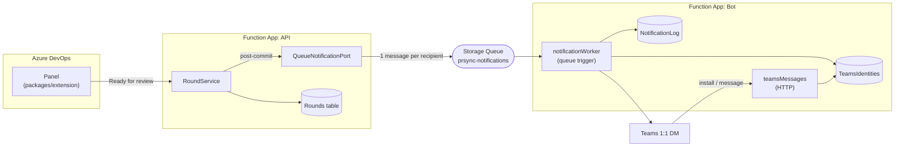

# 03 — Teams Notifications

Grill-me session, 2026-07-27. Feature 3 of PRSync: the Azure Bot that
turns round-lifecycle transitions into personal 1:1 Teams DMs. Builds on
Feature 1's `NotificationPort` seam
(`packages/api/src/services/NotificationPort/NotificationPort.ts`) and
the frozen card templates in `docs/handoff/adaptive-cards/`.

## Background

Feature 1 shipped the round lifecycle behind a domain-language
`NotificationPort` (`roundOpened` / `roundClosed`), called post-commit
with failures isolated, backed in v1 by `NoopNotificationPort` — a
deliberate stub. Feature 2 shipped the panel. Feature 3 supplies the
real adapter behind that same interface, and is the first PRSync
component that leaves the ADO surface entirely.

Prior context: `docs/design-logs/01-round-lifecycle.md` (Q9 — the
notification seam; Q7 — exactly-once close), `docs/ubiquitous-language.md`
(Round-opened / Round-closed notification, PRSync as Teams identity),
the frozen `docs/handoff/adaptive-cards/{reviewer,author}-notification.json`,
and the `Round` type in `packages/api/src/lib/types/types.ts`.
`packages/bot` is scaffolded to a `package.json` and an empty `src/`.

A personal 1:1 DM per person requires a registered Azure Bot with
proactive messaging. A Teams incoming webhook can only post to a channel
or a pre-configured chat, never to an arbitrary individual — this is why
the bot exists from v1 rather than being deferred alongside the
interactive card actions.

## Problem

Define how a committed round transition becomes a DM in a named
person's Teams chat: where the bot runs relative to the API, what
crosses the boundary between them, how delivery survives failure, how
an ADO reviewer resolves to a Teams conversation, and how
user-controlled text and URLs reach an Adaptive Card safely.

## Questions and Answers

**Q1 — `packages/bot` as a library in the API's Function App, its own
app called over HTTP, or its own app behind a queue?** ✅ Own Function
App, decoupled by an Azure Storage Queue. The library option creates a
workspace dependency `@prsync/api → @prsync/bot`, and
`func azure functionapp publish` does not reliably carry an
npm-workspaces symlink into the published zip. The HTTP option fixes
that but invents a service-to-service auth problem. The queue removes
both and buys delivery durability (Q3) with the same decision.

**Q2 — What crosses the queue: a round reference, or the payload?**
✅ A self-contained, denormalized envelope, one message per recipient.
The bot never reads the Rounds table. A reference would put the round
schema under two owners and open a race where the round mutates between
enqueue and send — a "round opened" card rendering post-close state.
Snapshotting into the message makes each DM reflect the transition that
caused it.

**Q3 — Fire-and-forget inline send, or a durable outbox?** ✅ Outbox.
Feature 1 isolates port failures so a dropped DM cannot fail a committed
round — correct, but it makes a swallowed exception a silently lost
notification. For this product the notification _is_ the feature. A
queue trigger provides retry, backoff and a poison queue as
infrastructure rather than code.

**Q4 — Fan-out granularity for `roundOpened`?** ✅ One message per
reviewer, not one per round: per-recipient retry and poison, and one
unreachable person cannot block the others. Enqueue sequentially; a
failure on message 3 of 5 logs and continues. A partial fan-out beats an
aborted one.

**Q5 — At-least-once delivery duplicates DMs. Dedupe how?** ✅ A
`NotificationLog` table, ordered check → send → mark. The narrow window
(send succeeds, mark fails) yields one duplicate on retry.
❌ Claim → send never duplicates but loses the notification permanently
on a mid-send crash. Chosen deliberately: **duplicates over drops** — a
lost "safe to proceed" is the failure this product exists to prevent.

**Q6 — What is retryable?** Terminal (log, complete the message, never
retry): no conversation reference for the recipient; unrecognised
`schemaVersion`. Transient (throw, let the queue retry and poison after
the default 5 dequeues): Bot Framework and network errors. Retrying a
missing install five times teaches nothing.

**Q7 — Does an unreachable reviewer change the round?** ❌ No. The round
entity stays at `schemaVersion: 1` and the API stays ignorant of Teams.
Reachability lives in `NotificationLog`, owned by the bot — which is
also exactly the data a future "these reviewers weren't reached" panel
affordance would read. Deferred, not designed here.

**Q8 — How is a conversation reference captured?** ✅ On the install
`conversationUpdate` (the bot itself in `membersAdded`), via
`TurnContext.getConversationReference()`, and re-persisted on every
subsequent inbound activity. References go stale; refreshing on any
activity is cheap insurance.

**Q9 — Keyed by what, and how does an ADO reviewer resolve to it?**
✅ Normalized (lowercased, trimmed) email, in a `TeamsIdentities` table.
This is the shared-tenant assumption already recorded in the ubiquitous
language: ADO's `uniqueName` is the AAD UPN, which is the Teams email.
Resolution is a **point read** by `(partitionKey, rowKey)` — no scan, no
filter, injection impossible by construction, matching `RoundRepository`.
`aadObjectId` is stored but unused as a key in v1; it is the migration
path if email resolution proves unreliable, and what the reserved
`teamsIdOverride` field would eventually carry.

**Q10 — Uninstall?** ✅ Handle it — delete the row on
`conversationUpdate` with the bot in `membersRemoved`. A dead reference
burns five retries into poison on every future round, and deleting keeps
the PII story honest: the identity is held exactly as long as the person
has the bot installed.

**Q11 — Is the bot `isNotificationOnly`?** ❌ No. Notification-only
reads as the tighter choice but costs three things: no way for a user to
confirm their install worked, no activity-driven reference refresh (Q8),
and a forced manifest change when v2 adds interactive card actions. One
message handler replying with a short help card is worth all three.
_Verify the current Teams manifest semantics against Microsoft's docs
when writing the manifest — this answer comes from general knowledge,
not from the codebase._

**Q12 — Templating library or typed card builders?** ✅ Typed builders,
no `adaptivecards-templating` dependency, with the handoff JSON kept
authoritative by test. The handoff cards live outside any package, so
importing them at runtime means either a build-time copy that silently
drifts or a cross-package path that breaks bundling. The co-located
tests read the handoff JSON by relative path (**test-only** — it never
enters the bundle), substitute the `${...}` placeholders, and assert
deep equality. Drift becomes a red test.

**Q13 — `prUrl` reaches `Action.OpenUrl`. Where does it come from?**
From the request body at round-open, currently stored without scheme
validation — so it is attacker-controlled. ✅ Defend at both ends:
tighten the `openRound` zod schema to require an `https:` URL, and add a
pure `safeCardUrl` in the bot that omits the card's action entirely
rather than emitting a hostile one. Also escape Adaptive Card markdown
control characters in `roundLabel`, `prTitle` and `authorName` —
`TextBlock` renders limited markdown, so a crafted PR title can
otherwise inject a link. Escaping uniformly avoids having to remember
that `FactSet` values are safer than `TextBlock` text.

**Q14 — Single-tenant or multi-tenant Azure Bot?** ✅ Single-tenant. The
bot is sideloaded inside one org's tenant and will never be listed in
the Teams Store; single-tenant narrows the token audience to that
directory.

**Q15 — The Teams app package?** ✅ `packages/bot/teams/manifest.json`
plus copies of `icon-teams-color-192.png` and `icon-teams-outline-32.png`
(already at Teams' required dimensions), zipped by an npm `package`
script into `prsync-teams.zip` — mirroring how `packages/extension`
produces its `.vsix`. `scopes: ["personal"]` only; there is no channel
surface in this product.

## Design

### Topology



The two Function Apps share **no code and no synchronous call**. The
queue is the entire boundary.

### Queue envelope

```ts
// packages/api/src/services/QueueNotificationPort/types.ts — the
// producer's copy. The bot declares its own structurally narrower
// version reading only the fields it needs; schemaVersion is the
// compatibility guard, and an unrecognised value is terminal.
interface NotificationMessage {
  schemaVersion: 1;
  event: "roundOpened" | "roundClosed";
  prKey: string;
  roundNumber: number;
  recipient: { adoId: string; email: string; displayName: string };
  card: {
    roundLabel: string;
    prTitle: string;
    prUrl: string;
    authorName: string;
  };
}
```

❌ A shared `packages/contracts` package — it would reintroduce the
workspace-dependency deploy problem (Q1) for both apps to solve a
20-line type.

### Delivery semantics

`QueueNotificationPort implements NotificationPort` in
`packages/api/src/services/QueueNotificationPort/`. It enqueues and does
nothing else; it replaces `NoopNotificationPort` in the API's
composition. **The `NotificationPort` interface and every line of
`RoundService` are untouched** — the seam doing its job.

- `roundOpened` → one message per tracked reviewer (required _and_
  optional, per the ubiquitous language).
- `roundClosed` → one message, to the author.
- `cancelled` → nothing. Cancellation is silent by design.

Worker dedupe key: `{roundNumber}|{event}|{recipientAdoId}`, in a
`NotificationLog` table with `PartitionKey = prKey`. Rows carry
`status: "sent" | "no-identity" | "failed"` and a timestamp.

### Identity

```ts
// packages/bot/src/storage/TeamsIdentityRepository/
// PartitionKey = "teams-identity", RowKey = normalizeEmail(email)
interface TeamsIdentity {
  email: string; // normalized — the row key
  aadObjectId: string; // stored, unused as a key in v1
  teamsUserId: string;
  conversationReference: string; // serialized ConversationReference
  displayName: string;
  updatedAt: string; // ISO
}
```

Captured on install, refreshed on every inbound activity, deleted on
uninstall. Resolution is a point read; a miss is terminal, not an error.

### Layer placement (`packages/bot/src/`)

Same discipline as `packages/api`: folder-per-module with a co-located
test, exactly one barrel `index.ts` per layer, cross-layer imports
through the target barrel, within-layer imports by direct file path.

| Layer        | Purpose                                                                      | Rule                                     |
| ------------ | ---------------------------------------------------------------------------- | ---------------------------------------- |
| `lib/`       | `normalizeEmail`, `dedupeKey`, `safeCardUrl`, `escapeCardText`, shared types | LEAF; every function tested              |
| `cards/`     | `reviewerCard`, `authorCard`                                                 | Pure; asserted against the handoff JSON  |
| `storage/`   | `TeamsIdentityRepository`, `NotificationLogRepository`                       | Only layer touching `@azure/data-tables` |
| `services/`  | `IdentityDirectory` (capture/resolve/forget), `NotificationDispatcher`       | Business rules                           |
| `teams/`     | `CloudAdapter` wiring, `TeamsSender` (proactive send)                        | The ONLY module importing `botbuilder`   |
| `functions/` | `teamsMessages` (HTTP), `notificationWorker` (queue trigger)                 | Thin — delegate and return               |

`teams/` is the exact analogue of the extension's `sdk/` layer: one
module owns the vendor SDK, so `NotificationDispatcher` is unit-testable
against a fake `TeamsSender` with no Bot Framework in the test at all.

### Security posture

- `/api/messages` must be `authLevel: "anonymous"` — Azure Bot Service
  cannot present a Function key. It is **not** an open endpoint:
  `CloudAdapter` validates the Bot Framework JWT against the app id,
  password and tenant on every request. The combination looks alarming
  in review and is deliberate; it belongs in `docs/deployment.md`.
- Single-tenant bot (`MICROSOFT_APP_TYPE=SingleTenant`) narrows the
  token audience to the org's directory.
- All card text is markdown-escaped; card URLs must be `https:` or the
  action is omitted. `openRound` rejects a non-`https:` `prUrl` at the
  API boundary.
- Table access is by exact partition + row key only — no user input
  reaches an OData filter.
- Conversation references are deleted on uninstall.

### Environment

```
# packages/bot
MICROSOFT_APP_ID=
MICROSOFT_APP_PASSWORD=
MICROSOFT_APP_TENANT_ID=          # new — single-tenant
MICROSOFT_APP_TYPE=SingleTenant   # new
AZURE_TABLES_CONNECTION_STRING=

# packages/api
AZURE_QUEUES_CONNECTION_STRING=   # new — may be the same account
PRSYNC_NOTIFICATION_QUEUE_NAME=   # new — default prsync-notifications
```

Neither package has a `host.json` yet; both need one, and the bot's
carries the queue trigger's batch and retry settings.

## Implementation Plan

1. **Install capture.** Bot Function App scaffold + `host.json`,
   `teams/` `CloudAdapter` wiring, `functions/teamsMessages`,
   `IdentityDirectory.capture`, `TeamsIdentityRepository`. A person
   sideloads PRSync, and a row appears; messaging the bot returns the
   help card. Thin but genuinely end-to-end: Teams → bot → storage →
   Teams.
2. **Cards.** `lib/escapeCardText`, `lib/safeCardUrl`, `cards/reviewerCard`,
   `cards/authorCard`, each asserted against the frozen handoff JSON.
   Pure, no infrastructure.
3. **Worker.** `functions/notificationWorker`, `NotificationDispatcher`,
   `NotificationLogRepository`, terminal-vs-transient handling. Driven
   by a hand-enqueued message — **the first real DM**.
4. **Producer.** `QueueNotificationPort` replaces `NoopNotificationPort`
   in the API's composition; `openRound` tightens `prUrl` to `https:`.
   Closes the loop: Ready for review → DM.
5. **Packaging.** Uninstall handling, `teams/manifest.json`, the icons,
   the `prsync-teams.zip` script, and the `docs/deployment.md` section
   (bot registration, the anonymous-endpoint rationale, sideloading).

## Trade-offs

**Easier:**

- The `NotificationPort` seam pays off exactly as designed — Feature 3
  is additive, and `RoundService` is not edited at all.
- Two Function Apps that share only a queue deploy independently, with
  no cross-service auth and no workspace-dependency packaging trap.
- Retry, backoff and poison handling are infrastructure, not code.
- `NotificationDispatcher` is fully unit-testable with no Bot Framework
  and no Teams, behind the `TeamsSender` port.
- The denormalized envelope makes each DM a faithful snapshot of the
  transition that produced it, immune to later round mutation.

**Harder / accepted:**

- Two deploy targets, two sets of app settings, and a queue to operate.
- The envelope type is declared twice (narrowly on the consumer side);
  `schemaVersion` carries the compatibility contract instead of the
  compiler.
- Duplicate DMs are possible by design (Q5). Chosen over silent loss.
- Local development needs Azurite queues plus a tunnel to reach
  `/api/messages` from Azure Bot Service.

**Ruled out of scope:**

- Interactive card actions ("mark Done" from Teams) — v2. v1 cards are
  link-out only.
- Surfacing unreachable reviewers in the panel — the `NotificationLog`
  data exists for it, but it needs a new API read path and panel state.
- `teamsIdOverride` UI — the schema field stays reserved and unused.
- Reminder notifications for long-pending reviews — deferred.
- Any channel or group-chat surface — personal scope only.
