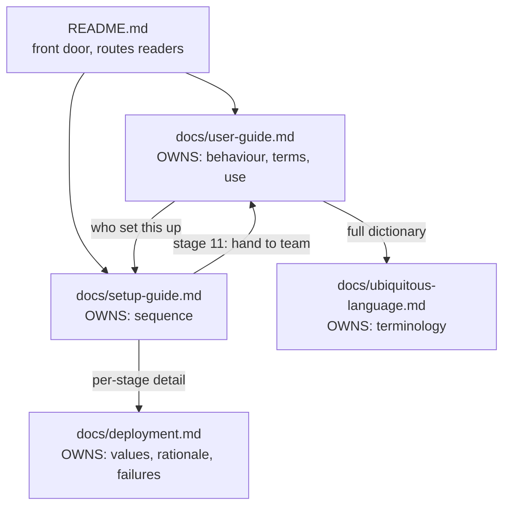

# 04 — Documentation / User Manual

Grill-me session, 2026-07-30. Feature 4 of PRSync: the user-facing
documentation the project does not have. Ships documentation only — no
build dependency on Features 1–3, and no product code changes beyond a
one-line manifest correction.

## Background

Features 1–3 shipped with a complete paper trail: three design logs,
three PRDs, three refactor plans, `docs/dev-journal.md`,
`docs/ubiquitous-language.md`, and `docs/deployment.md` (606 lines,
written by Feature 3's Phase 5). Every word of it is written for whoever
_maintains_ PRSync.

Two readers have nothing:

- The **operator** standing PRSync up for the first time.
  `docs/deployment.md` is organised by prerequisite, not by order of
  operations — it states what must be true, never what to do first. The
  ordering is derivable but wrong by default: the bot Function App must
  be deployed _before_ its messaging endpoint can be set (buried as step
  4 inside "Registering the Azure Bot resource"), and nothing says the
  Teams app should be sideloaded before the API is worth testing.
- The **teammate** who receives a DM, or — the harder case — who does
  not. **Unreachable** (`docs/ubiquitous-language.md`) is a logged fact
  the panel does not surface, so a person who never sideloaded the bot
  experiences nothing at all and cannot tell it from "no round opened".

There is also more than one user-facing surface, each independently
editable and already drifting: `README.md`, `packages/extension/vss-extension.json`'s
`description`, `packages/bot/teams/manifest.json`'s `description.full`,
and the panel's own copy (`EmptyState`, `ErrorState`, `RefreshBanner`,
`StatusPill`). The manifest already contradicts the domain: it says
_"when the last reviewer marks themselves done"_, which is the unanimity
rule superseded by **quorum** in `docs/design-logs/01-round-lifecycle.md`.

Prior context: `docs/deployment.md` (the reference this builds on),
`docs/ubiquitous-language.md` (the term authority),
`docs/handoff/panel-layout-spec.md` (the role × state decomposition),
`docs/handoff/adaptive-cards/` (the frozen card content), and
`packages/bot/src/test/deploymentDocs.test.ts` (the verification model).

## Problem

Write the documentation a person needs to _use_ PRSync — both to stand
it up and to live with it — without (a) duplicating `docs/deployment.md`
into a second thing that rots, (b) paraphrasing the ubiquitous language
into friendly prose that contradicts it, or (c) leaving the reader who
gets no DM with nothing to read.

## Questions and Answers

**Q1 — One manual, or a split? And which document owns the ordered
setup path?** ✅ Three documents with strict ownership:
`docs/setup-guide.md` owns **sequence**, `docs/user-guide.md` owns
**use**, `docs/deployment.md` keeps owning **values and rationale**.
`README.md` becomes the front door that routes readers. The binding
rule: _the setup guide names no value that `deployment.md` defines_ — it
says "set the four bot settings" and links, never listing them. Sequence
in one file, values in the other, nothing to drift.
❌ One manual covering setup and use: forces one document to serve both
"read straight through once" and "look up the thing I forgot", which is
what makes `deployment.md` hard to start from.
❌ Restructuring `deployment.md` to lead with a walkthrough: cheaper, but
same conflation.

**Q2 — Who is the setup guide written for, given the steps need three
different authorities (Azure, Teams tenant admin, ADO org owner) and the
last step belongs to each teammate?** ✅ One operator track, addressed to
a single named reader, flagging _inline_ where a step needs someone
else's permission. The teammate's two steps live at the top of
`docs/user-guide.md`; the setup guide's final stage hands that link over.
❌ Splitting the guide by role: fragments a sequence whose entire value
is being one sequence.

**Q3 — What is the correct stage order?** ✅ Eleven stages, each ending
in a positive check — see [Design](#design). Two deliberate placements:
**sideload (6) before API deploy (7)**, so stage 7's checkpoint has a
reachable recipient; and **CORS as its own stage (8)**, not folded into
the API deploy.

**Q4 — Where does troubleshooting live, given `deployment.md` already
has a symptom table?** ✅ Failures stay in `deployment.md`. Each stage
carries only "you'll know this worked when X" plus one link for when it
isn't. The Q1 no-duplication rule applied to failures as well as values.

**Q5 — Does the setup guide cover local development (Azurite + tunnel)?**
✅ No. Real-deployment path only, linked once from stage 0. Local dev is
a contributor concern, already covered in
`docs/deployment.md#local-development`, and including it doubles the
branch count of every stage.

**Q6 — How do plain language and the ubiquitous language stay in
agreement?** ✅ The user guide **glosses**, never defines. One section,
"Five words PRSync uses precisely" (Round, Done, Quorum, Cancel vs
Close, Reviewer list), each entry being canonical term + one plain
sentence + the counter-intuitive consequence. Those five appear bolded
and verbatim everywhere else in the guide; the aliases-to-avoid columns
of `docs/ubiquitous-language.md` become a lint list.
❌ Restating the definitions in friendlier words: the failure mode is
concrete — "when everyone's finished reviewing, the round closes" is
natural prose that directly contradicts **quorum**.

**Q7 — What is a person told when a DM never arrives?** ✅ A four-rung
self-service ladder in the user guide ("I didn't get a message"), ending
honestly at the operator, who is the only one who can read
`NotificationLog`. Paired with a stage-11 line telling the operator that
installing the Teams app is not optional. Also stated plainly: a
duplicate DM is deliberate at-least-once delivery, not a bug.

**Q8 — Screenshots?** ✅ None, in either document. There is no deployed
environment to shoot from; the panel is dual-theme so any shot is wrong
for half the readers; and a screenshot is a claim no test can check. The
panel is described by role × state (the decomposition
`docs/handoff/panel-layout-spec.md` already uses and the components
implement); the cards are quoted from the frozen
`docs/handoff/adaptive-cards/` JSON, which _is_ test-asserted.

**Q9 — Which of the four user-facing surfaces is authoritative?**
✅ `docs/user-guide.md` is authoritative for what PRSync does. The
Marketplace description, the Teams manifest and the README are derived
short forms that may summarise but never add a claim. The panel's copy
stays as-is — there is no help affordance in v1, and adding one is a
code change this feature does not make. Falls out immediately: the
manifest's unanimity sentence is corrected.

**Q10 — How is this verified, the way this repo already verifies docs?**
✅ A sibling `packages/bot/src/test/userDocs.test.ts`, in the spirit of
`deploymentDocs.test.ts` — six assertions, see
[Verification](#verification).

**Q11 — README, and the commit initiative?** ✅ README restructured, not
rewritten: the "Why This Project Exists" and methodology framing is the
portfolio value and stays. Adds a Documentation block routing the three
readers, updates Build Status, trims "Running from Source" to defer to
the setup guide. Initiative: `user-docs`.

## Design

### Document ownership

Every arrow is a real markdown link, and every one is asserted to
resolve. No box restates what a box below it owns.

### The eleven stages (`docs/setup-guide.md`)

| #   | Stage                                                       | Ends when                                           |
| --- | ----------------------------------------------------------- | --------------------------------------------------- |
| 0   | Before you start — accounts, permissions, tools, names      | The four names are written down                     |
| 1   | Create storage: 3 tables + 1 queue                          | `az storage table list` shows all three             |
| 2   | Register the Azure Bot (F0, Single Tenant) + client secret  | App id, secret and tenant id are in hand            |
| 3   | Deploy the **bot** Function App with its settings           | The app's URL responds                              |
| 4   | Messaging endpoint + enable the Teams channel               | Endpoint saved, Teams channel listed                |
| 5   | Allow custom app upload in the tenant                       | The setup policy shows On                           |
| 6   | Package and sideload `prsync-teams.zip` (operator first)    | The bot replies; a `TeamsIdentities` row exists     |
| 7   | Deploy the **API** Function App with its settings           | **A hand-enqueued queue message lands a real DM**   |
| 8   | Allow the ADO origins in the API's CORS                     | Both origins listed                                 |
| 9   | Build, package, publish the extension; install into the org | The PRSync tab appears on a PR                      |
| 10  | End to end on a real PR                                     | Reviewers got DMs; the author got "safe to proceed" |
| 11  | Roll out — hand each teammate the zip and the user guide    | —                                                   |

Stage 3 must precede stage 4 (the endpoint needs a URL that exists).
Stage 6 must precede stage 7, so stage 7's check has a reachable
recipient — that check proves stages 1–7 with no ADO, no panel and no
round involved, using the hand-enqueue recipe already in
`docs/deployment.md#exercising-the-worker-without-the-panel`. Stage 8 is
separate because CORS is the failure that yields a working-looking
install with a dead panel; folded into stage 7 it gets skipped.

### `docs/user-guide.md` shape

1. **Install PRSync** — the teammate's two steps (sideload the zip; find
   the tab). The only thing that makes a person **Reachable**.
2. **Five words PRSync uses precisely** — the gloss section (Q6).
3. **What you'll see** — panel by role × state: Author / Reviewer /
   Bystander × round open / no round open, matching
   `docs/handoff/panel-layout-spec.md` and the components in
   `packages/extension/src/components/`.
4. **What arrives in Teams** — the two cards, quoted from
   `docs/handoff/adaptive-cards/`.
5. **I didn't get a message** — the four-rung ladder (Q7).
6. **Where the words come from** — one line to
   `docs/ubiquitous-language.md`.

### Verification

`packages/bot/src/test/userDocs.test.ts`, reusing
`src/test/fixtures/sourceFiles.ts` and the `section()` helper pattern
from `deploymentDocs.test.ts`:

| #   | Assertion                                                                                                              | Rot it catches                             |
| --- | ---------------------------------------------------------------------------------------------------------------------- | ------------------------------------------ |
| 1   | The setup guide's numbered stage headings are complete and in order                                                    | A stage silently deleted or reordered      |
| 2   | No `MICROSOFT_APP_*` / `AZURE_*` / `PRSYNC_*` / `VITE_*` token in the setup guide outside a link                       | The Q1 no-duplication rule breaking        |
| 3   | Every relative link and `#anchor` across the three docs resolves                                                       | The path silently ceasing to be a path     |
| 4   | Every bolded term in "Five words" exists verbatim in `ubiquitous-language.md`                                          | A renamed concept diverging                |
| 5   | No unanimity alias (`unanimous`, `consensus`, `everyone`, `all reviewers`, `signed off`, `approved`) describes closing | Friendly prose contradicting **quorum**    |
| 6   | The same alias check on `packages/bot/teams/manifest.json`'s `description.full`                                        | The already-present manifest contradiction |

Assertions 3–6 are strong (mechanical facts). 1–2 are structural. None
of them claim to check prose quality — the same honesty
`deploymentDocs.test.ts` records about its own weak describes.

### Files

| Path                                     | Change                                           |
| ---------------------------------------- | ------------------------------------------------ |
| `docs/setup-guide.md`                    | New — the eleven stages                          |
| `docs/user-guide.md`                     | New — the teammate's manual                      |
| `packages/bot/src/test/userDocs.test.ts` | New — the six assertions                         |
| `README.md`                              | Restructured — Documentation block, Build Status |
| `docs/deployment.md`                     | Cross-links back to the setup guide only         |
| `packages/bot/teams/manifest.json`       | `description.full` unanimity sentence corrected  |
| `packages/extension/vss-extension.json`  | `description` reduced to a summary + pointer     |

## Implementation Plan

1. **The teammate's manual.** `docs/user-guide.md` end to end, plus
   assertions 4 and 5 of `userDocs.test.ts`. Thinnest genuinely useful
   slice: it is the document with no existing substitute anywhere in the
   repo, and it stands alone without the setup guide existing.
2. **The operator's path.** `docs/setup-guide.md`, the eleven stages,
   plus assertions 1 and 2. Cross-links into `deployment.md` land here.
3. **The links and the front door.** README restructure,
   `deployment.md` back-links, and assertion 3 — which can only be
   written once all three documents exist.
4. **The derived surfaces.** The manifest `description.full` correction,
   `vss-extension.json`'s description, and assertion 6.

## Trade-offs

**Easier:**

- One place to change a setting's name (`deployment.md`) and one place
  to change the order (`setup-guide.md`), with a test that keeps them
  from swapping jobs.
- A first-time operator gets a checkpoint at stage 7 that isolates the
  entire notification path before ADO, the panel or a round exists —
  the single most diagnostic moment in the sequence.
- The gloss-not-define rule means `ubiquitous-language.md` stays the one
  authority, and a term rename goes red rather than quietly producing
  two dialects.
- No screenshots means no maintenance surface that no test can cover.

**Harder / accepted:**

- Four documents now cross-reference each other, and a reader following
  the setup guide will click into `deployment.md` and back. That is the
  cost of not duplicating; assertion 3 keeps the clicks from breaking.
- The user guide describes the panel in prose, which is less immediate
  than a screenshot for a first-time reader.
- "I didn't get a message" ends at "ask whoever set PRSync up". That is
  honest rather than satisfying, and it stays true until **Unreachable**
  is surfaced in the panel — which needs an API read path and panel
  state neither of which is modelled.
- Assertion 5's alias list is a blunt instrument: it will occasionally
  need a sentence rephrased that was not actually wrong.

**Ruled out of scope:**

- **In-panel help.** The panel has no help affordance and adding one is
  product code; this feature ships documentation. Its existing copy is
  what the manual is written to match.
- **Screenshots** (Q8). If added later: `docs/images/`, dark theme only,
  and never of a state no test covers.
- **Local development in the setup guide** (Q5) — stays in
  `deployment.md`.
- **A published Marketplace listing page.** `vss-extension.json`'s
  description is in scope; the Marketplace's own long-description
  authoring is not, since nothing is published yet.
- **Real `privacyUrl` / `termsOfUseUrl` pages.** Both still point at the
  repository (`packages/bot/README.md` already flags it); they are
  needed before PRSync goes beyond sideloading in one tenant, and that
  is not a documentation task.
